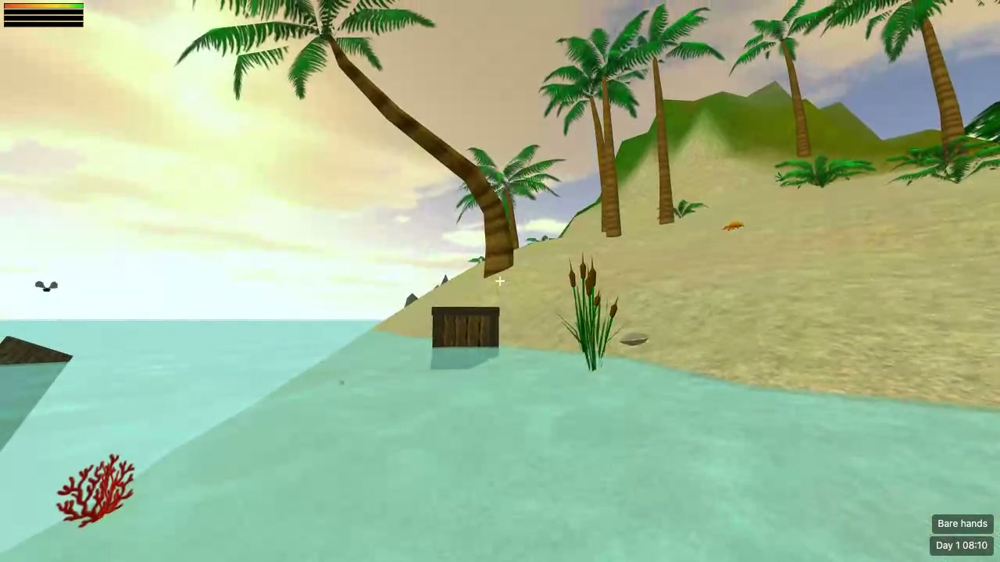

# Stranded II Web

English | [简体中文](README.zh-CN.md)

A faithful browser remake of *Stranded II*, the 2007 island survival game by Unreal Software, written in TypeScript with Three.js. The original models, textures, maps and scripts are loaded at runtime, and the game rules are ported from the published Blitz3D source, so the adventure plays the way it did in 2007.

**Play it:** https://ethan-chen-dev.github.io/stranded2-web/

## Features

- The full adventure campaign, map01 to map07, including the intro sequence, dialogues, diary and map transitions.
- The original survival loop: hunger, thirst and exhaustion, sleeping, diving with limited air, day and night cycle driven by the original light table.
- Items, crafting, building, digging and fishing driven by the original definition files and the S2 scripting language (about 270 script commands implemented).
- Animal AI ported from the original state machine: wandering, fleeing, hunting, attacking, taming and feeding, with the original animal sounds.
- Riding animals and driving the raft, boats and the airplane.
- Status effects as in the original: bleeding, poison, burning and spreading fire, healing, dizziness and more.
- Weather (rain, snow, thunder), the original particle effects, grass, shore waves, wind sway and motion blur.
- Melee, ranged, firearm and thrown weapons with projectiles.
- Save and load, quick save (F5) and quick load (F9); saves live in the browser's local storage and can be exported to and imported from JSON files.
- Options for key bindings, mouse, view range, effects, grass, motion blur and volume.

## Controls

| Key | Action |
|---|---|
| Mouse | Look around (click the view to lock the pointer) |
| W A S D, Space | Move, jump |
| Left button | Attack with hands, the held weapon, a bow or a thrown item |
| Right button | Use the held tool: hammer builds, spade digs, fishing rod fishes; bare-handed it equals Use |
| E | Pick up, use, talk, loot a corpse, open a container; get off while riding |
| Tab | Inventory: select several items to combine; hold, use or drop items |
| B | Building menu |
| T | Diary and skills |
| Y | Sleep (only when tired; sleeping in the open costs health) |
| Esc | Pause menu with save and load; skips a cutscene |
| F5 / F9 | Quick save, quick load |

Keys can be changed under Options in the main menu or the pause menu.

## Status

This is an alpha. Desktop browsers only (Chrome, Edge, Firefox); pointer lock is required, so phones and tablets are not supported.

Not implemented yet: the trade tab in dialogues, the random island generator and the map editor.

Found something that behaves unlike the original? That counts as a bug: see the pinned [bug reports and feedback](https://github.com/ethan-chen-dev/stranded2-web/issues/1) issue. For impressions and open questions there is [Discussions](https://github.com/ethan-chen-dev/stranded2-web/discussions).

## Development

See [docs/DEVELOPMENT.md](docs/DEVELOPMENT.md) for setup, tests, build, project layout and deployment.

## License and credits

*Stranded II* was created by Peter Schauß / Unreal Software, https://www.unrealsoftware.de. Its source code was released under CC BY-NC-SA 3.0 DE; this remake is a derived work released under the same license for non-commercial use only. See [LICENSE](LICENSE).

The game assets (models, textures, sounds, music, maps and definition files) remain the property of Peter Schauß / Unreal Software. They are not part of this repository; the playable site hosts them with the author's permission (granted by e-mail on 2026-09-06), see [ASSETS-LICENSE.txt](ASSETS-LICENSE.txt).
