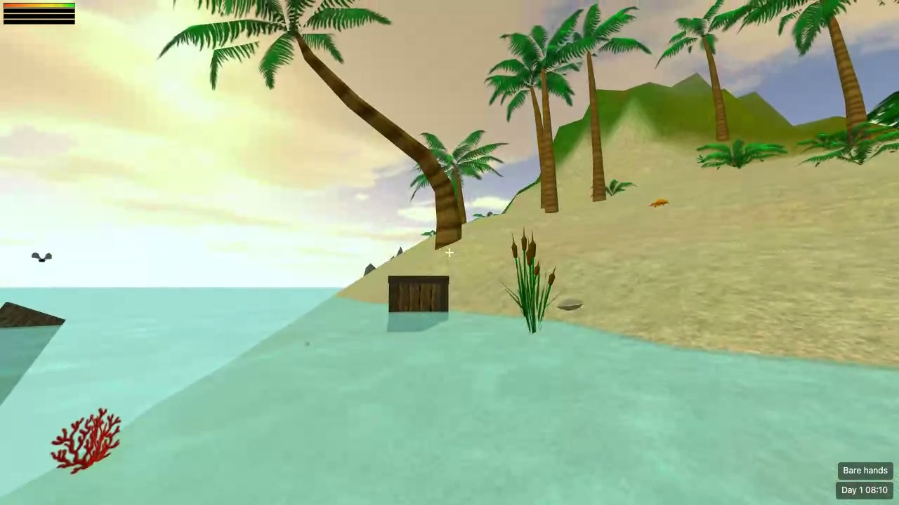

# Stranded II Web

[English](README.md) | 简体中文

Unreal Software 2007 年荒岛生存游戏《Stranded II》的浏览器复刻，TypeScript + Three.js 实现。运行时直接读取原版的模型、贴图、地图和脚本，游戏规则按公开的 Blitz3D 源码移植，目标是忠实还原原版。

**在线试玩：** https://ethan-chen-dev.github.io/stranded2-web/

## 功能

- 完整的冒险战役 map01 到 map07，包括开场序列、对话、日记与地图切换。
- 原版生存循环：饥饿、口渴、疲劳，昼夜循环与原版光照表。
- 由原版定义文件与 S2 脚本语言驱动的物品、合成、建造、挖掘与钓鱼（已实现约 270 条脚本指令）。
- 按原版状态机移植的动物 AI：游荡、逃跑、追击、攻击、驯养与觅食。
- 近战、远程、火器与投掷武器，带投射物。
- 存档与读档，F5 快速存档、F9 快速读档；存档保存在浏览器本地存储中。

## 操作

| 按键 | 作用 |
|---|---|
| 鼠标 | 转视角（点击画面锁定指针） |
| W A S D、空格 | 移动、跳跃 |
| 左键 | 攻击：徒手、手持武器、弓或投掷 |
| 右键 | 使用手持工具：锤子建造、铲子挖掘、鱼竿钓鱼；徒手时等于使用 |
| E | 拾取、使用、对话、搜刮尸体、打开容器 |
| Tab | 背包：多选后合成，物品可手持、使用、丢弃 |
| B | 建筑菜单 |
| T | 日记与技能 |
| Esc | 暂停菜单（保存、读取）；过场序列中跳过 |
| F5 / F9 | 快速存档、快速读档 |

## 现状

目前是 alpha 版本。只支持桌面浏览器（Chrome、Edge、Firefox），需要指针锁定，手机和平板不支持。

尚未实现：载具驾驭、对话中的交易页、粒子特效、随机岛生成器、地图编辑器。

欢迎通过 GitHub Issue 反馈问题，请附上地图名和复现步骤。

## 开发

环境准备、测试、构建、目录结构与发布流程见 [docs/DEVELOPMENT.zh-CN.md](docs/DEVELOPMENT.zh-CN.md)。

## 许可与致谢

《Stranded II》由 Peter Schauß / Unreal Software 制作，官网 https://www.unrealsoftware.de 。原版源码按 CC BY-NC-SA 3.0 DE 公开，本项目是其移植改编，按相同许可发布，仅限非商业用途，详见 [LICENSE](LICENSE)。

游戏素材（模型、贴图、音效、音乐、地图、定义文件）版权归 Peter Schauß / Unreal Software，不包含在本仓库中；试玩站点经作者许可（2026-09-06 邮件同意）托管这些素材，见 [ASSETS-LICENSE.txt](ASSETS-LICENSE.txt)。
